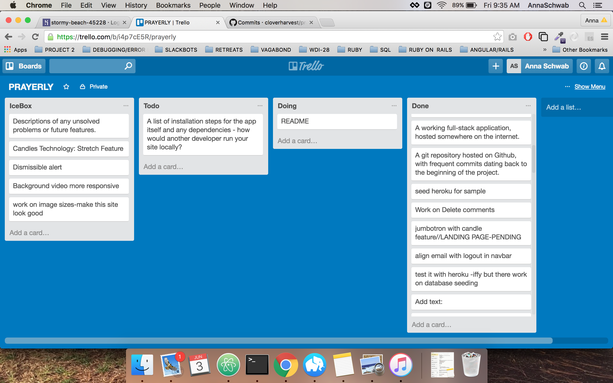

## Prayerly

```
prayer
/prer/
noun  

   * a solemn request for help or expression of thanks addressed to
     God or an object of worship.  
   * synonyms:	invocation, intercession, devotion; archaicorison  
   * a religious service, especially a regular one, at which people
     gather in order to pray together.
   * an earnest hope or wish.
```

### What is Prayerly

Link to Prayerly: http://stormy-beach-45228.herokuapp.com/

This is a prayer app built on Rails.

An anonymous user can go to the site, lookup a prayer via a search form or dropdown filter. He or she can also add a prayer intentions via an individual prayer.

An admin, on the other hand, is able to full crud prayers; edit and delete comments; and add prayer categories.

While most of the prayers are in the Christian/Catholic discipline, this app is modular and can be used to build prayer applications of different faiths.

It is the builder's intent and purpose that this contributes well to open source and that this would also serve as a spiritual encouragement for programmers and believers, alike.

Credit goes to EWTN, catholiconline.com, praymorenovenas.com, gratefulness.com for the direction and inspiration with regard to content.

She would also like to thank her instructors Juliana, Justin, Nathan and D-i-R Nick at General Assembly for teaching her the fine art and science of web development.

Please also visit Saintly, a saints database app built on Mongoose, Express and Node.js(MEN) stack.
Link to Saintly: https://rocky-fortress-73738.herokuapp.com/

###Technology Stack

* Ruby on Rails
* Postgresql
* HTML and CSS
* Bootstrap and Material Design Colors

###Features

* Full CRUD
* Object-Oriented Programming
* Search Boxes
* Associations: 1:Many, M:M
* Join Tables
* RESTful routes and more
* MVC

### Planned Features

* Light candles and dedicate it to a person or purpose
* Have candles glow more if it is dedicated to a person with the same name or purpose
* Ability to tag prayer intentions that have been read and prayed for by other users

### Some set-up

* Admin path is /log_in
* Additional gems: humanizer(captcha), bcrypt, twitter-bootstrap


###Screenshots



